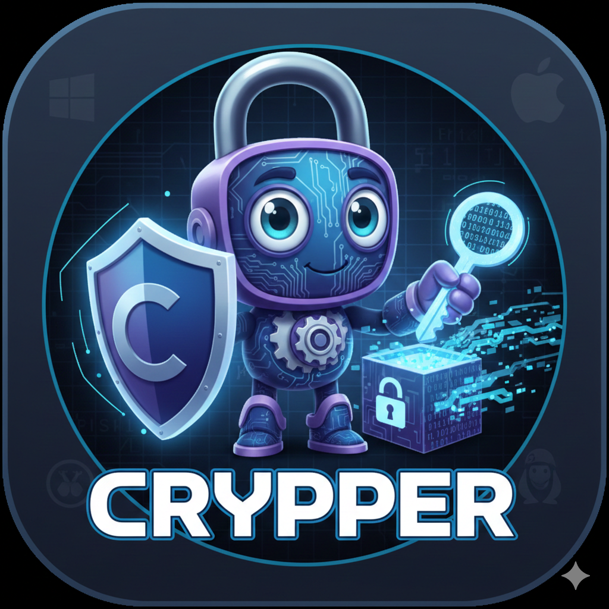
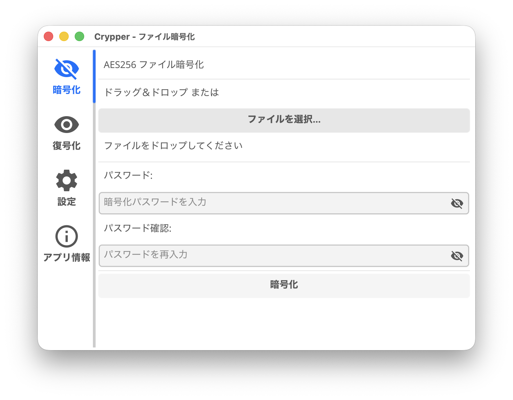
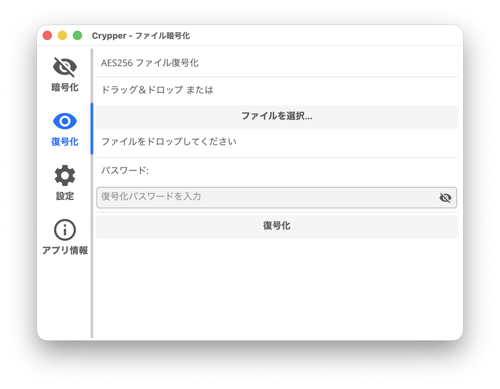
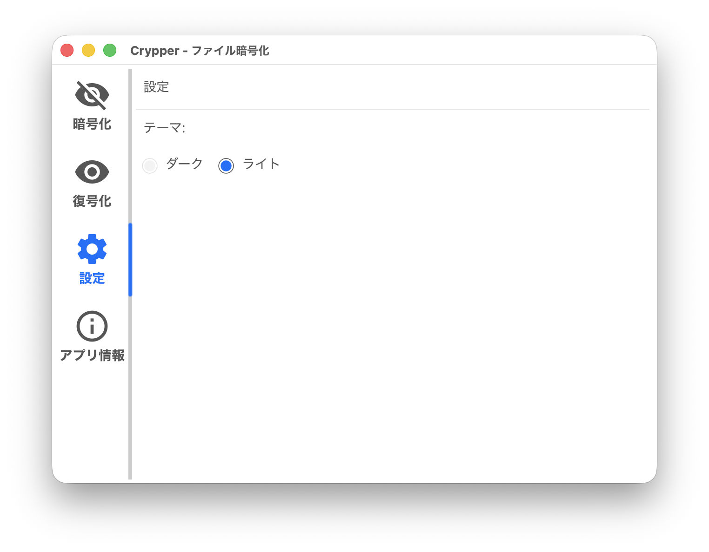
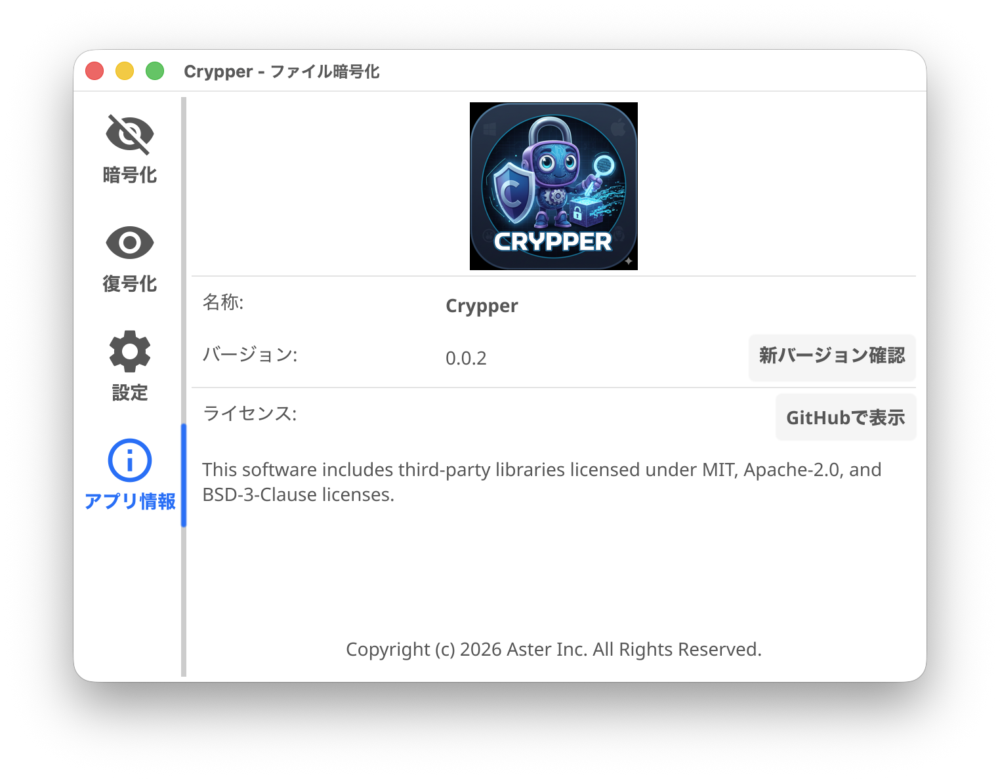

# Crypper

 

Crypper is a Go-based Encryption/Decryption utility application.

A cross-platform application supporting Windows, macOS, and Linux.

## Features

- **File Encryption**: AES-256-GCM encryption/decryption with Argon2id key derivation
- **Cross-Platform**: Supports Windows, macOS, and Linux
- **Drag & Drop**: Easy file selection via drag and drop
- **App Info**: View application information and check for updates
- **Internationalization**: Supports English and Japanese

## Why AES-256-GCM with Argon2id?

### AES-256-GCM vs AES-256-CBC

| | AES-256-GCM | AES-256-CBC |
|---|---|---|
| **Authentication** | Built-in (AEAD) | Requires separate MAC |
| **Integrity Check** | Automatic | Manual implementation needed |
| **Padding Oracle Attack** | Not vulnerable | Vulnerable |
| **Performance** | Parallelizable | Sequential only |
| **Modern Standard** | Recommended by NIST | Legacy mode |

**AES-256-GCM** (Galois/Counter Mode) is an authenticated encryption mode that provides both confidentiality and integrity in a single operation. It detects any tampering with encrypted data, preventing attacks where adversaries modify ciphertext.

**AES-256-CBC** (Cipher Block Chaining) only provides confidentiality and is vulnerable to padding oracle attacks if not carefully implemented with a separate MAC (Message Authentication Code).

### Why Argon2id for Key Derivation?

Argon2id is the winner of the Password Hashing Competition (2015) and is recommended by OWASP for password hashing. It combines:

- **Memory-hardness**: Resistant to GPU/ASIC brute-force attacks
- **Time-hardness**: Configurable iteration count
- **Hybrid approach**: Combines Argon2i (side-channel resistant) and Argon2d (GPU-resistant)

Compared to older algorithms like PBKDF2 or bcrypt, Argon2id provides stronger protection against modern hardware-accelerated attacks.

## Screenshots

| Encryption | Decryption |
|:----------:|:----------:|
|  |  |

| Settings | App Info |
|:--------:|:--------:|
|  |  |

## Download

Download binaries for your platform from the [Releases](https://github.com/aster-com/crypper-bin/releases/latest) page.

| Platform | Architecture | File |
|----------|--------------|------|
| Windows | x64 (amd64) | `crypper-windows.zip` |
| macOS | Apple Silicon (arm64) | `crypper-macos.zip` |
| Linux | x64 (amd64) | `crypper-linux.tar.xz` |

## License

Copyright (c) 2026 Aster Inc. All Rights Reserved.

### Third-Party Licenses

This software uses the following open source libraries.
See the [licenses/](./licenses/) folder for full license texts.
